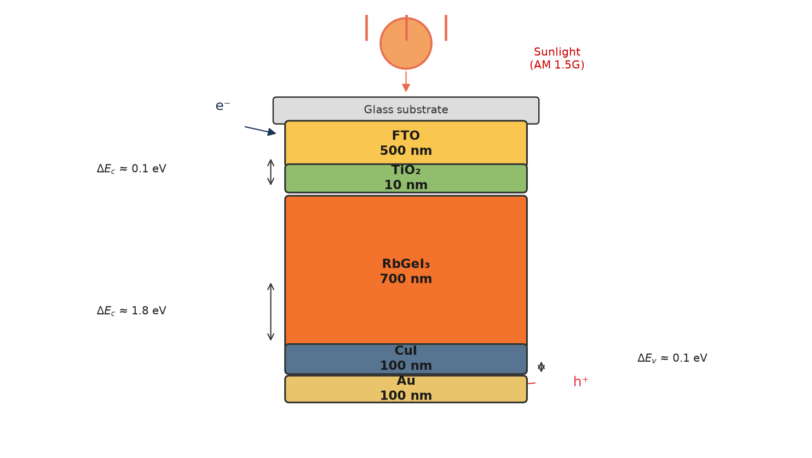
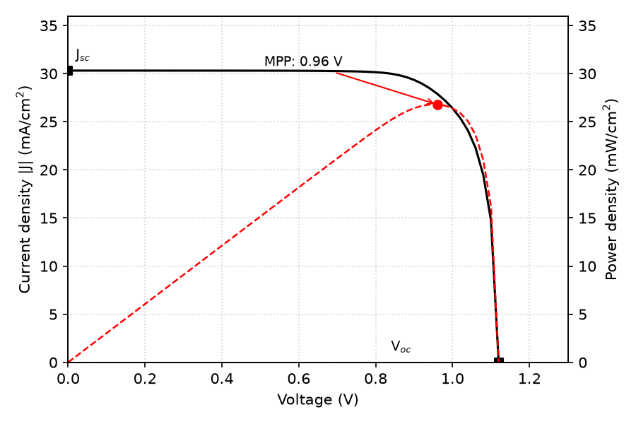
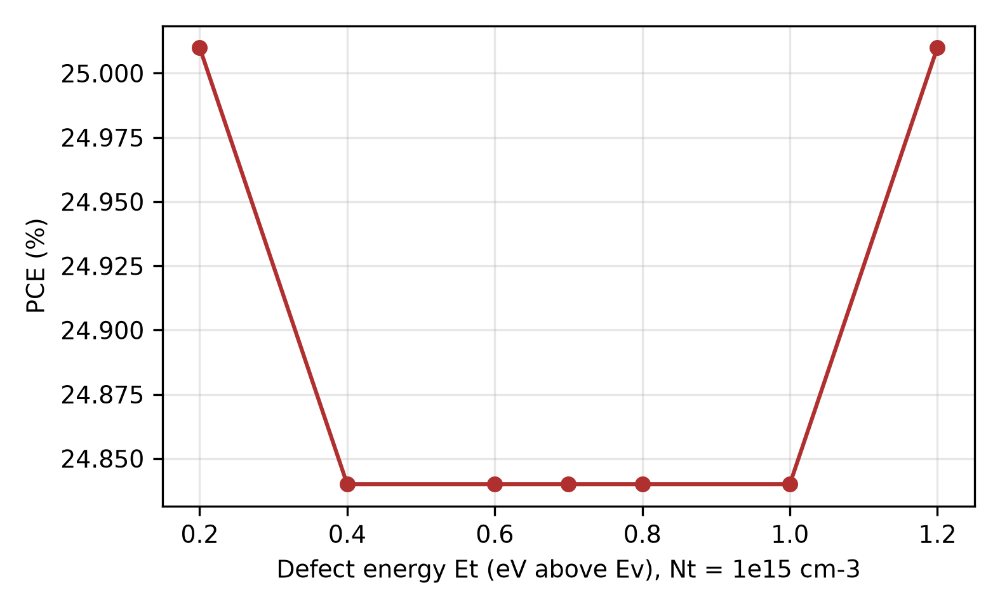
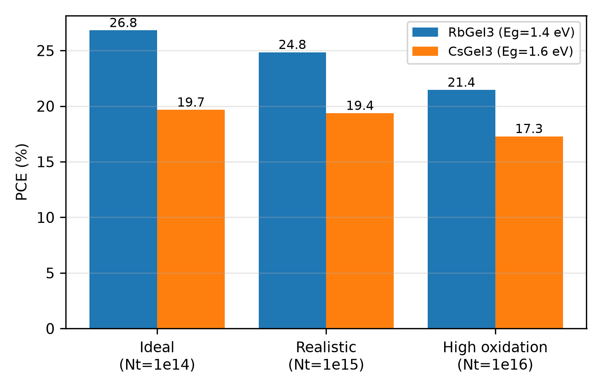

# Defect-Tolerant Design of Lead-Free RbGeI₃ Solar Cells

> **Status (Sep 2026): under review at *Solar Energy* (Elsevier) as a Regular Paper.**
> *Defect-Tolerant Design of Lead-Free RbGeI₃ Solar Cells: From SCAPS-1D Optimization
> to Manufacturing Tolerances, Benchmarked Against CsGeI₃.*

## What this is

This repository contains the full simulation study behind the paper: a SCAPS-1D
numerical optimization of a lead-free **FTO/TiO₂/RbGeI₃/CuI/Au** perovskite solar
cell, extended beyond standard efficiency sweeps into the physics that decides
whether such a cell can actually be built — defect energy levels and capture
asymmetry (the Ge²⁺ → Ge⁴⁺ oxidation threat), background doping windows, series-
resistance manufacturing tolerances, mobility viability floors, an activation-
energy diagnostic, and a same-stack **CsGeI₃ comparison** that isolates the
A-site cation effect.

The headline device reaches **26.81% PCE** (V_OC 1.13 V, J_SC 30.32 mA/cm²,
FF 78.26%), reported explicitly as an ideal-coupling upper bound with a
quantified realistic window of ≈20.7–23.5%.


*Device stack: FTO / TiO₂ (10 nm) / RbGeI₃ (700 nm) / CuI (100 nm) / Au.*

## Key results

| Result | Value |
|---|---|
| Optimized PCE (AM 1.5G, 300 K) | 26.81% (1.13 V · 30.32 mA/cm² · 78.26%) |
| Defect tolerance | PCE ≥ 24.8% at N_t = 10¹⁵ cm⁻³; mid-gap traps most lethal |
| Doping target | N_A ≤ 10¹⁵ cm⁻³ (peak 26.82% near 3×10¹⁴) |
| Series-resistance threshold | PCE ≥ 20% up to R_s = 8 Ω·cm² |
| Mobility floor | PCE ≥ 25.8% for μ ≥ 15 cm²/Vs; 700 nm holds over 400 nm |
| Recombination diagnostic | E_a = 1.46 eV ≈ E_g → bulk-limited, not interface-limited |
| CsGeI₃ benchmark | 19.66% in the identical stack; RbGeI₃ leads at every defect level |
| Uncertainty (N = 200 LHS) | PCE = 25.92 ± 1.78% |


*J–V characteristic of the consolidated optimized device (26.81%).*


*PCE vs defect energy at N_t = 10¹⁵ cm⁻³: symmetric mid-gap minimum, the SRH fingerprint.*


*Same-stack comparison under ideal, realistic, and high-oxidation defect budgets.*

## How it was done

1. **Screening** — 8 ETL×HTL combinations; TiO₂/CuI selected on band alignment.
2. **Sequential (OAT) optimization** — 11 parameters, 71 runs, optima carried forward.
3. **Joint checks** — 320-point factorial grid + 6-gene genetic algorithm (mathematical maximum 31.78%, reported as such, not claimed as the device).
4. **Tolerance sweeps (Round 5)** — defect energy/capture asymmetry, doping, series resistance (external V − J·R_s correction), mobility, temperature (E_a fit).
5. **CsGeI₃ mirror** — full 11-family OAT (71 runs) changing only the absorber bandgap; an E_g = 1.4 eV control reproduces RbGeI₃ exactly, proving A-site isolation.
6. **Robustness** — 200-sample Latin-hypercube UQ, mesh-convergence check (< 0.02%), arithmetic `V_OC·J_SC·FF/100 = PCE` gate on every parsed result.

Simulation engine: **SCAPS-1D 3.3.10** under Wine via `scaps-runner` (4 workers).
Manuscript pipeline: Word master → `mk_latex.py` (elsarticle) → `slim.py` /
`slim2.py` (main/supplement split, renumbering) → `trim.py` (condensation) →
`pdflatex`. Full provenance in [`r5_results/R5_REPORT.md`](r5_results/R5_REPORT.md).

## Repository layout

```
├── solar_submission/        # Submission package (the paper)
│   ├── manuscript.pdf       # Main paper, 36 pp
│   ├── supplement.pdf       # Supplementary S1–S3, 11 pp
│   ├── titlepage.pdf        # Standalone title page
│   ├── cover_letter.txt / highlights.txt
│   └── figs/                # All 31 figures, 300 dpi
├── paper/round5/            # Full-record Word master (42 pp)
├── r5_results/              # All Round-5 results as JSON + figures
├── r5_*.py                  # Sweep + analysis scripts
├── mk_latex.py / slim.py / slim2.py / trim.py   # Manuscript build chain
└── Final circuit.scaps      # SCAPS device definition
```

## Reproduce our results

Requirements: Linux, Python 3 with `numpy`/`matplotlib`, Wine + `scaps-runner`
with SCAPS-1D 3.3.10 installed (4 worker prefixes in `~/.scaps-runner/`), and the
device file copied to the runner definitions:

```bash
cp "Final circuit.scaps" ~/.scaps-runner/scaps_dat/def/perovskite-rbgei3.def  # or r5_base.def equivalent
scaps-runner status
```

Then, from the repo root (full campaign takes on the order of an hour on 4 workers):

```bash
python3 r5_baseline.py                       # frozen headline device + J–V
python3 r5_et_sigma.py                       # defect energy / capture asymmetry (~18 runs)
python3 r5_na.py                             # background doping (7 runs)
python3 r5_mobility.py                       # mobility, incl. 400 nm checks (15 runs)
python3 r5_temp.py                           # temperature sweep for E_a (8 runs)
python3 r5_csgei3.py && python3 r5_csfinal.py # CsGeI3 mirror (71 runs) + consolidation
python3 r5_rs.py                             # series-resistance map (post-processing, instant)
python3 r5_figures.py r5_figures2.py         # regenerate all figures/tables from JSONs
```

Every parser is fail-closed: per-input result files plus an arithmetic
consistency gate, so crashed runs surface as `FAILED` instead of silently
returning stale data. Rebuild the paper with
`python3 mk_latex.py && python3 slim.py && python3 slim2.py && python3 trim.py`,
then `pdflatex` twice in `solar_submission/` (see
[`solar_submission/README.md`](solar_submission/README.md) for the venue checklist).

## Authors

- **Md. Abdul Malek Fahim** (first author) — mdabdulmalekfahim@gmail.com
- **Hussain Touhid Siddiquee** (second and corresponding author) — touhidsiddiqueeraj@gmail.com

Department of Electrical and Electronic Engineering, Leading University, Sylhet, Bangladesh.

## Citation

```bibtex
@article{fahim2026rbgei3,
  title   = {Defect-Tolerant Design of Lead-Free RbGeI3 Solar Cells:
             From SCAPS-1D Optimization to Manufacturing Tolerances,
             Benchmarked Against CsGeI3},
  author  = {Fahim, Md. Abdul Malek and Siddiquee, Hussain Touhid},
  journal = {Solar Energy (under review)},
  year    = {2026}
}
```
